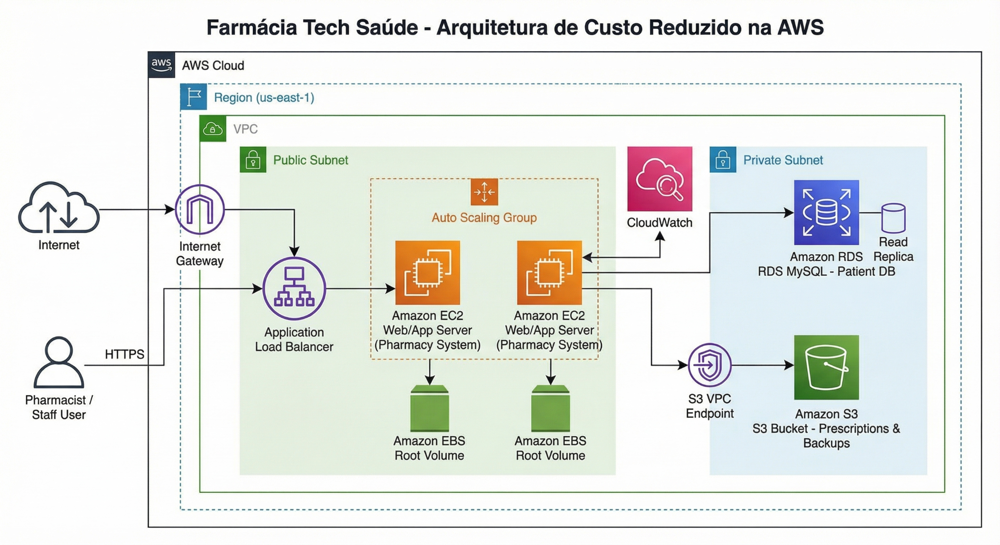

# Otimização de Custos e Migração para Nuvem: Tech Saúde Farmácias 💊☁️

## 📋 Resumo Executivo
Este projeto apresenta a estratégia de migração de infraestrutura *on-premises* para a nuvem AWS de uma rede de farmácias. O objetivo principal foi solucionar problemas de escalabilidade e reduzir o TCO (*Total Cost of Ownership*), migrando de um modelo de custos fixos (CapEx) para um modelo variável e otimizado (OpEx).

A arquitetura proposta foca em alta disponibilidade na região de **São Paulo (sa-east-1)** para garantir baixa latência no atendimento ao cliente.

---

## 🏗️ Arquitetura da Solução

A solução foi desenhada seguindo os pilares do *AWS Well-Architected Framework*, segregando responsabilidades em camadas:

### Decisões Técnicas
* **Aplicação (Amazon EC2):** Instância `t3a.small` (processador AMD para menor custo) configurada com *Savings Plans*, garantindo performance para o ERP com custo previsível.
* **Banco de Dados (Amazon RDS):** Migração para serviço gerenciado (MySQL), eliminando *overhead* administrativo de manutenção de hardware e backup manual.
* **Armazenamento (Amazon S3):** Offloading de arquivos estáticos (receitas digitais, notas fiscais) para o S3, reduzindo a necessidade de discos EBS caros e garantindo durabilidade de 99,999999999%.

---

## 💰 Análise de FinOps (Custos e Economia)

Foi realizada uma estimativa detalhada utilizando a *AWS Pricing Calculator*. A estratégia adotada priorizou compromissos de longo prazo (Savings Plans de 3 anos) para maximizar os descontos.

> **📄 Documentação Completa:** [Ver Estimativa Detalhada em PDF](docs/estimativa-custos-aws.pdf)

| Serviço AWS | Configuração | Custo Mensal (USD) | Justificativa Estratégica |
| :--- | :--- | :--- | :--- |
| **Amazon EC2** | t3a.small (2 vCPU, 2GB) | $ 11,02 | *Compute Savings Plan* (3 anos) reduziu o custo em ~50%. |
| **Amazon RDS** | db.t3.micro (MySQL) | $ 91,98 | Custo compensado pela eliminação de horas-homem (DBA). |
| **Amazon S3** | Standard (50 GB) | $ 2,03 | Custo marginal para alta retenção de dados. |
| **Total Mensal** | **Infraestrutura** | **$ 105,03** | **~R$ 610,00** |

### 📉 ROI (Retorno sobre Investimento)
* **Custo Anterior (On-Premises):** ~R$ 1.500,00/mês (Hardware, Energia 24/7, Refrigeração).
* **Custo Novo (AWS):** ~R$ 610,00/mês.
* **Economia Estimada:** **~60% de redução mensal** no orçamento de TI.

---

## 🚀 Etapas de Implementação

1.  **Assessment:** Mapeamento do servidor legado e volumetria de dados.
2.  **Provisionamento:** Configuração de VPC, Security Groups e instâncias (EC2/RDS) via Console AWS.
3.  **Migração de Dados:** Upload de arquivos históricos para o S3 e *dump* do banco para o RDS.
4.  **Go-Live:** Virada de chave DNS e monitoramento via CloudWatch.

---

## 👩‍💻 Autoria

<table align="left">
  <tr>
    <td align="center">
      <a href="https://github.com/brulprado">
         
        
          <b>Bruna Lima Prado</b>
        
      </a>
    </td>
  </tr>
</table>
      

*Projeto desenvolvido como parte do Bootcamp de Ciência de Dados.*
